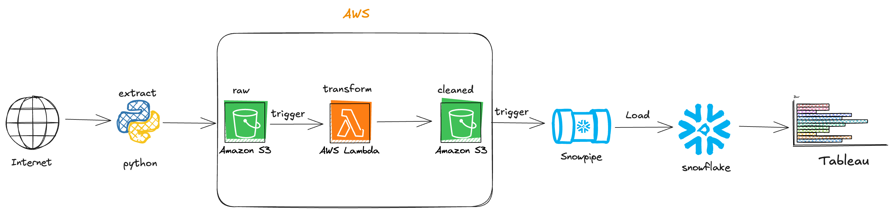

# Pakistan Senate Sessions Attendance | Data Engineering Project

## Introduction 
In this data engineering project, we leverage Amazon S3 and AWS Lambda to create a scalable and efficient data processing pipeline. Amazon S3 serves as our primary storage solution, enabling us to store and manage vast amounts of data securely. AWS Lambda facilitates serverless computing, allowing us to execute code responding to events, such as data uploads, for real-time processing and transformation. The processed data is then ingested into Snowflake, our cloud-based data warehouse, which can be seamlessly queried and analyzed. Finally, we utilize Tableau for dynamic data visualization, empowering stakeholders to explore insights and trends interactively. 

## Purpose 
The data engineering project is about finding interesting insights from a country's senate website. The website contains data about the session and the members/senator who were present in the session. Senators information e.g names, constituencies, party, province/state, and the city is also present. The project aims to blend all of this for interesting insights like which party's senators participate in the sessions regularly, individual senator participating trends, city or state/province-wise participation, etc. 

## Directory contents:
 - Screenshots -> Contains Tableau dashboard screenshots.
 - Scripts -> Python scripts of extraction from website, transformation/cleaning of data.
 - Data -> Scraped data in raw format and cleaned/transformed data.
   
## Architecture 

## Technologies Used
1. Programming Language  - Python
2. Scripting Language - SQL
3. AWS
   - Lambda
   - S3
4. Snowflake ( Data Warehouse )
5. Tableau ( Visualization )

## Data Model:

## Dataset Used:

Data is scraped from the website, https://www.na.gov.pk/en/all-members.php and https://www.na.gov.pk/en/attendance2.php, using Python's BeautifulSoup4 Library. 

- https://github.com/sherafgunmetla/pak-senate-data-engineering/blob/main/members_details_raw/2024-09-25.csv
- https://github.com/sherafgunmetla/pak-senate-data-engineering/tree/main/members_attendance_raw

### More about the dataset
There are 2 datasets. First one contains the members details e.g Name, Constituency, Address, City, Province & Party. The second one is member's attendance in the session, in the form of pdf files, which are uploaded when the session is held. 

## Scrips for the project

1. [Scrap Scripts](https://github.com/sherafgunmetla/pak-senate-data-engineering/tree/main/Scripts/Scrap)
2. [Cleaning & Transforming Scripts](https://github.com/sherafgunmetla/pak-senate-data-engineering/tree/main/Scripts/Transform)
3. [Snowflake](https://github.com/sherafgunmetla/pak-senate-data-engineering/blob/main/snowflake_query.sql)

## Tableau Visualization  

--------------

--------------

--------------

